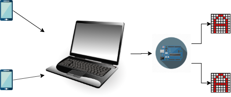

# Girl's day Battleship

## Hardware requirements

Required material per match:

- 2x LED Matrix packages like ones mentioned [here](http://johnny-five.io/api/led.matrix/):

  

- Arduino Uno

- Laptop

## Architecture

A laptop works as game server, and connects to an Arduino, which connects to two LED matrices.

## Software requirements

[Johnny Five library](http://johnny-five.io/api/led.matrix/): Allows using JavaScript code to run on Arduino. The library also has necessary modules for interacting with a LED matrix.

[socket.io](https://socket.io/): Websockets-server. Receives requests from client (mobile phone?) and forwards commands to Johnny Five.

## Protocol

The client needs to connect to the game server via websocket, and send the target board position like `1A`, `5F` to attack. The number represents the row, while the letter represents the column. The range will depend on the size of the matrix.

The server performs some checks:
- Are there 2 players?
- Is this your turn?

If one of the checks doesn't pass, it returns `ERROR`. Otherwise, it returns `OK` and forwards the command to the Game engine.

Protocol table:

Sender      | Command | Example   | Possible responses
------------|---------|-----------|--------------------
Client      | Attack  | `3G`      | `OK`, `ERROR (only 1 player)`, `ERROR (not your turn)`
Server      | Victory | `victory` | N/A
Server      |         |           |
Game Engine | Lost    | `lost`    | `OK`

## Tasks for the girls

- Build the mobile client app.
- Implement the game engine:
  - Turn off LED if ship is hit.
  - Game over when all ships are destroyed.

## Tasks for us

- Randomly setup the boards.
- Handle errors.
